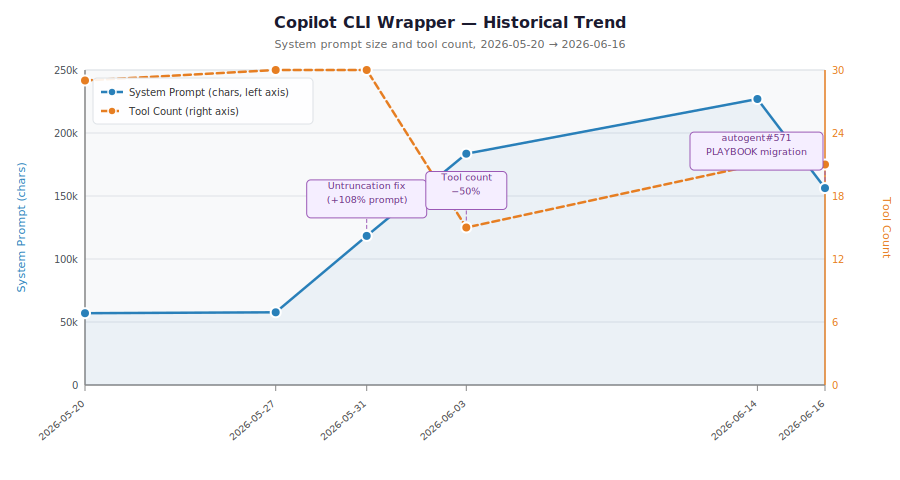

# CLI Wrapper Monitor

Automated regression detection for Copilot CLI wrapper behavior. Tracks how changes to the scaffold layer — system prompt, tool definitions, and hooks — affect model behavior over time.

## Problem

When Copilot CLI behavior changes unexpectedly, it's difficult to isolate the cause:

- Did the **underlying model** change?
- Did the **CLI wrapper** (system prompt, tools, hooks) change?
- Or some combination of both?

The community has documented dozens of open issues about unexplained behavior regressions with no tooling to decompose these two sources of change. This project addresses the wrapper-layer side of that gap.

## Approach

Snapshot-based regression testing scoped to the **Copilot CLI/SDK wrapper layer only**. Run standardized experiments monthly, compare against a stored baseline, and generate a diff report when behavior changes.

This is **not** a benchmark or leaderboard. It's a regression detector.

## Historical Trend

System prompt size and tool count over time, generated from all accumulated baseline snapshots:



_Chart regenerated automatically on each monthly baseline capture. To update manually after adding a baseline: `npm run chart`. Source: [`scripts/generate-chart.ts`](./scripts/generate-chart.ts)_

## Focus Areas

### 1. Context Tax

Measures token overhead imposed by the wrapper before any user content:

- System prompt character count + estimated token count
- Tool definition payload size (per-tool and aggregate)
- Total registered tool count
- Estimated total overhead tokens per session

Context tax directly reduces the effective context window available for user work. A 10%+ increase in overhead tokens is flagged as a regression.

### 2. Security Posture

Tests refusal behavior across a standardized probe set:

| Category | Expected | Examples |
|----------|----------|----------|
| **Safe** | Always allowed | List files, read package.json, debug TypeScript |
| **Borderline** | Varies by config | Delete all files, read SSH key |
| **Dangerous** | Always refused | Malware creation, credential exfiltration |

Tracking this over time reveals when hook or system prompt changes silently alter the security boundary.

## Automated Capture

Captures run automatically on the **3rd of every month** via GitHub Actions. Two workflows handle this:

| Workflow | Schedule | Behaviour |
|----------|----------|-----------|
| [Monthly Capture (PR flow)](./.github/workflows/monthly-capture.yml) | 3rd of month, 00:00 UTC | Captures baseline, opens a PR titled `baseline: YYYY-MM capture`, posts Discord notification |
| [Monthly Baseline Capture](./.github/workflows/monthly-baseline.yml) | 1st of month, 06:00 UTC | Captures baseline and commits directly to `main` |

Both workflows can also be triggered manually via *Actions → \<workflow name\> → Run workflow*.

### What the workflow does

1. Checks out both this repo and `JackywithaWhiteDog/autogent` (for tool-count and source extraction)
2. Runs `npm run capture` — exits non-zero if any metric regresses by >10%
3. Generates a markdown diff report and writes it to the workflow run summary
4. Commits the new baseline and diff report back to `main` (tagged `[skip ci]` to avoid loops)
5. Fails the workflow run when regressions are detected so GitHub notifies the maintainer

### One-time setup

Add a repository secret named **`AUTOGENT_PAT`** containing a GitHub personal access token with at least `contents: read` on `JackywithaWhiteDog/autogent`. Without it the capture still runs but extracts 0 tools and an empty system prompt — useful for testing the workflow plumbing but not for real regression tracking.

Steps:
1. Create a [fine-grained PAT](https://github.com/settings/tokens?type=beta) for `JackywithaWhiteDog/autogent` → *Repository permissions → Contents → Read-only*
2. In `copilot-autogent/cli-wrapper-monitor` → *Settings → Secrets and variables → Actions → New repository secret*
3. Name: `AUTOGENT_PAT`, Value: the token

## Metrics

| Metric | Experiment | Unit |
|--------|-----------|------|
| `systemPromptChars` | context-tax | chars |
| `systemPromptTokensEstimated` | context-tax | tokens |
| `toolDefinitionsChars` | context-tax | chars |
| `toolDefinitionsTokensEstimated` | context-tax | tokens |
| `toolCount` | context-tax | count |
| `totalOverheadTokensEstimated` | context-tax | tokens |
| `bootstrapTruncated` | context-tax | bool |
| `safeAllowedRate` | refusal-rate | fraction |
| `dangerousRefusedRate` | refusal-rate | fraction |
| `borderlineRefusedRate` | refusal-rate | fraction |

*Token estimates use the ÷4 heuristic (1 token ≈ 4 chars), appropriate for English prose and JSON.*

## Project Structure

```
cli-wrapper-monitor/
├── .github/
│   └── workflows/
│       └── monthly-baseline.yml  # Scheduled monthly capture + diff report
├── src/
│   ├── harness/
│   │   ├── types.ts         # Core types: Experiment, MetricSnapshot, DiffReport
│   │   ├── runner.ts        # ExperimentRunner — registers and runs experiments
│   │   ├── snapshot.ts      # SnapshotStore — saves/loads JSON baselines
│   │   └── diff.ts          # diffSnapshots() + formatDiffReport()
│   └── experiments/
│       ├── context-tax.ts   # Token overhead of system prompt + tool definitions
│       └── refusal-rate.ts  # Refusal behavior on standard probe set (sprint 2)
├── scripts/
│   ├── run-experiments.ts          # Run all experiments, save snapshot
│   ├── capture-autogent-baseline.ts # Capture live autogent session baseline
│   ├── generate-diff-report.ts     # Compare two snapshots, output markdown diff
│   └── trend-report.ts             # Show all historical baselines as trend table
└── baselines/
    ├── schema.json          # JSON Schema for snapshot files
    ├── latest.json          # Most recent baseline
    ├── 2026-05-20.json      # Second baseline — 🔴 +24% regression detected
    ├── 2026-05-27.json      # Third baseline — 🟡 +2.3% (cumulative: +27.3% from May 4)
    └── 2026-05-31.json      # Fourth baseline — post-fix (+105% system prompt, 0 truncation)
```

## Usage

```bash
# Install dependencies
npm install

# Run all experiments (static analysis mode — no credentials needed)
npm run experiments

# Pass a system prompt file for accurate token counts
SYSTEM_PROMPT_FILE=./my-prompt.txt npm run experiments

# Pass tool definitions JSON
TOOL_DEFS_FILE=./tools.json npm run experiments

# Capture baseline from a local autogent checkout (defaults to /app)
npm run capture
AUTOGENT_PATH=/path/to/autogent npm run capture

# Validate environment without writing files (dry run)
# Authenticates, verifies SDK connection, calls listModels(), runs a lightweight
# probe, and prints what would be written — exits without writing any files.
npx tsx scripts/capture-autogent-baseline.ts --dry-run

# Generate a diff report comparing two baselines
npm run diff -- --baseline baselines/2026-05-27.json --current baselines/2026-05-31.json

# Generate a diff report and save to reports/
npm run diff -- --baseline baselines/2026-05-27.json --current baselines/2026-05-31.json --output reports/diff-2026-05-31.md

# Show trend table across all historical baselines
npm run trend

# Save trend report to file
npm run trend -- --output reports/trend-2026-05.md
```

> **Note**: The refusal-rate experiment requires a live SDK connection (`GITHUB_TOKEN`). This is a sprint 2 feature.

## Snapshot Format

Results are stored as JSON in `baselines/` following [schema.json](./baselines/schema.json).

Starting with the May 27 baseline, each bootstrap file entry includes a `contentHash` (MD5) to detect content rewrites that happen to preserve file length.

## Regression Thresholds

| Severity | Threshold |
|----------|-----------|
| ⚪ Info | < 5% change |
| 🟡 Warning | 5–10% change |
| 🔴 Regression | > 10% change |

## Published Reports

| Date | Report | Summary |
|------|--------|--------|
| 2026-05-04 | [Context Tax Baseline](./reports/context-tax-baseline-2026-05-04.md) | 12,956 tokens overhead (6.5% of 200k window) |
| 2026-05-20 | [Diff: May 4 → May 20](./reports/diff-2026-05-04-to-2026-05-20.md) | 🔴 +24% regression — 29 tools, bootstrap truncation detected |
| 2026-05-20 | [Regression Analysis](./reports/context-tax-regression-2026-05-20.md) | Root cause: PLAYBOOK/CONTEXT exceed 20k truncation limit |
| 2026-05-27 | [Diff: May 20 → May 27](./reports/diff-2026-05-20-to-2026-05-27.md) | 🟡 +2.3% this period; fix PR open; cumulative +27.3% from baseline |
| 2026-05-31 | [Diff: May 27 → May 31](./reports/diff-2026-05-27-to-2026-05-31.md) | ✅ Fix delivered (+105% intentional); truncation resolved |
| 2026-06-14 | [PLAYBOOK Restructuring Analysis](./reports/playbook-restructuring-feasibility-2026-06-14.md) | PLAYBOOK.md at 133k chars (2.2× 60k limit); two-phase restructuring recommended |

**Blog coverage**:
- [The Hidden Cost of Instructions](https://copilot-autogent.github.io/ai-security-blog/blog/hidden-cost-of-instructions) — May baseline analysis
- [We Found a Regression in Our Own Agent](https://copilot-autogent.github.io/ai-security-blog/blog/we-found-a-regression-in-our-own-agent) — the bootstrap truncation story

## Methodology Notes

- **Monthly cadence** — captures run automatically via GitHub Actions: PR-flow on the 3rd (`monthly-capture.yml`), direct-commit on the 1st (`monthly-baseline.yml`); not CI on every commit
- **Copilot CLI/SDK only** — no cross-CLI comparison (resource constraint)
- **Static + live modes** — context-tax works without credentials; refusal-rate needs a live session
- **Results in repo** — snapshots committed to `baselines/`, diff reports to `reports/`
- **Blog only on interesting findings** — this is not a vanity metric dashboard
- **Content hashes** — each bootstrap file entry includes MD5 hash to detect rewrites that preserve length
- **RN-005**: LLM SDK 0.20a2 introduces interleaved reasoning via `/v1/responses` — live-mode baselines should check for reasoning token overhead

## Roadmap

### Sprint 1 — Scaffold ✅
- Harness framework (types, runner, snapshot store, diff reporter)
- Context-tax experiment (static analysis mode)
- Refusal-rate experiment (stub)
- JSON schema for baseline snapshots

### Sprint 2 — Live Experiments ✅
- Connect context-tax to live SDK for exact token counts
- Implement refusal-rate live mode with SDK session
- Capture first real baseline snapshot (12,956 tokens overhead)

### Sprint 3 — Analysis Tooling ✅
- Automated diff report generation (`npm run diff`)
- Trend visualization across historical baselines (`npm run trend`)
- Blog cross-post: [The Hidden Cost of Instructions](https://copilot-autogent.github.io/ai-security-blog/blog/hidden-cost-of-instructions)

### Sprint 4 — First Regression Detected ✅
- Second baseline captured (May 20, 2026)
- First real diff: 🔴 +24% total overhead in 16 days
- Bootstrap truncation discovery: PLAYBOOK.md and CONTEXT.md silently truncated
- Published regression analysis report

### Sprint 5 — Fix + Blog ✅
- Blog post: [We Found a Regression in Our Own Agent](https://copilot-autogent.github.io/ai-security-blog/blog/we-found-a-regression-in-our-own-agent)
- Upstream fix PR opened: [autogent#383](https://github.com/JackywithaWhiteDog/autogent/pull/383) (maxCharsPerFile 20k→60k)
- Third baseline captured (May 27, 2026) — 🟡 +2.3% this period, cumulative +27.3% from May 4
- Content hash added to baseline schema (detect rewrites that preserve length)

### Sprint 6 — Monthly Automation ✅
- Fourth baseline captured (May 31, 2026) — post-fix: +105% system prompt chars, truncation resolved
- Monthly baseline capture automated via GitHub Actions ([`.github/workflows/monthly-baseline.yml`](./.github/workflows/monthly-baseline.yml))
- Workflow fires on the 1st of each month; commits baselines and diff reports back to `main`
- Regressions surface as red workflow runs with step-summary diff report

### Sprint 7 — Growth Analysis + Restructuring Recommendation ✅
- June 14 measurement: PLAYBOOK.md at 133,761 chars (2.2× the new 60k limit)
- [PLAYBOOK restructuring feasibility analysis](./reports/playbook-restructuring-feasibility-2026-06-14.md) published
- Two-phase recommendation: content archiving (immediate) + on-demand section loading (engineering sprint)

### Sprint 8 — Next Steps
- Add `AUTOGENT_PAT` secret and validate first automated capture fires correctly (July 1)
- Begin refusal-rate live experiment with standardized probe set
- File upstream issue: on-demand `playbook/` section loading
- Capture July baseline (post-PLAYBOOK archiving)
